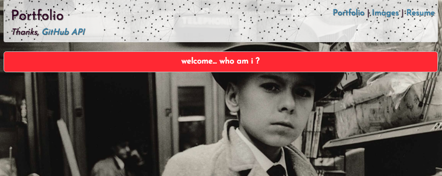

# Portfolio in React with GitHub API

#### _Advanced Topics in React Independent Project for Epicodus, September 29th, 2017_
**_By Calla Rudolph_ [(e-mail me here)](<mailto:callarudolph@gmail.com>)**

## Description
This React/Redux JS app was created to present my GitHub information into a portfolio using API calls with Redux-Thunk Middleware. It utilizes testing with Jest, React-Router, and UUID unique state keys.

Special thanks to GitHub's API: https://developer.github.com/v3/

## Prerequisites
* [Node.js](https://nodejs.org/) (with NPM)

You may need your own API Key from [GitHub](https://github.com/settings/tokens/new):

* Visit the website, add a Token description, and select scopes (read-only scopes are recommended).
* Generare token.
* Copy your Personal Access Token provided on the next page (ex: "a2c356ibgh44...").
* Create the .env file at the top level of your project folder and write: exports.apiKey = "[PASTE-YOUR-API-KEY-HERE]"; and save the file.

## Installation Instructions
* Open Terminal and type:
* `$ cd Desktop`
* `$ git clone https://github.com/CallaRudolph/react-portfolio`
* `$ cd react-portfolio`
* `$ npm install`
* `$ atom .`

### Serving Program
* In Terminal, run `$ npm run start`
* In your Browser (Chrome preferred) navigate to [http://localhost:8080/](http://localhost:8080/)

## Future Functionality
* Successfully import repo-reducer to display my starred repos (including the repo name, description, and cloneURL).

## Technologies Used
* [Node.js](https://nodejs.org/) (with NPM)
* [ReactJS](https://facebook.github.io/react/)
* [Redux](http://redux.js.org/)
* [Webpack](https://webpack.js.org/)
* [Babel](https://babeljs.io/)
* Bootstrap/CSS
* HTML

## License Information
Copyright &copy; 2017 Calla Rudolph

_Please email me at the above address with any comments or improvements you have found!_

This software is licensed under the MIT license.
